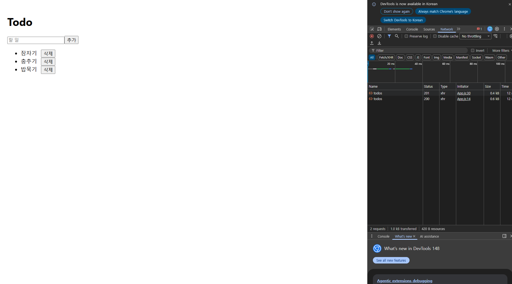
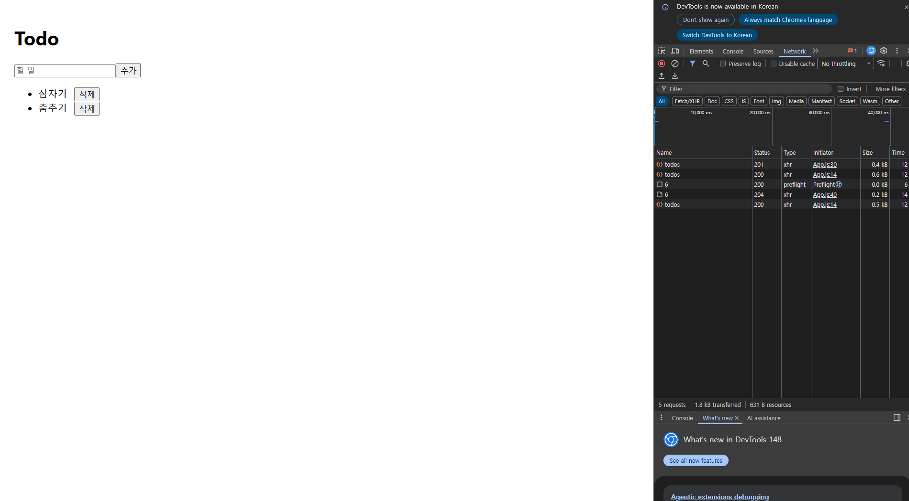

# 터미널 1 — backend/
cd backend
./mvnw spring-boot:run

# 터미널 2 — frontend/
cd frontend
npm install axios
npm start

백엔드: http://localhost:8080
프론트: http://localhost:3000

# 제출 체크리스트
- [x] `submissions/{GitHub아이디}/backend/` — Spring Boot
- [x] `submissions/{GitHub아이디}/frontend/` — React
- [x] `README.md`에 백엔드·프론트 실행 명령, 포트(8080/3000) 기재
- [x] 목록 조회·추가 동작 (필수)
- [x] 삭제 또는 완료 토글 중 하나 이상 (필수)
- [x] Network 탭 캡처 또는 screenshots 폴더
- [x] `node_modules/` 미포함
- [x] (선택) `useTodos` 훅 분리
- [ ] (선택) Axios 인터셉터

# 구현한 API 연동
- [x] GET `/api/todos`
- [x] POST `/api/todos`
- [x] DELETE `/api/todos/{id}`
- [x] PATCH `/api/todos/{id}/toggle`

# 막혔던 오류와 해결 방법
- `mvnw spring-boot:run` 실행 중 오류가 발생했다.
    - 해결 방법: `-e` 옵션으로 로그를 자세히 확인해 원인을 디버깅했고, 8080 포트가 이미 사용 중이라는 메시지를 보고 `netstat`으로 포트를 확인한 뒤 `taskkill`로 충돌을 해제해 해결했다.
    
# 실행 화면

