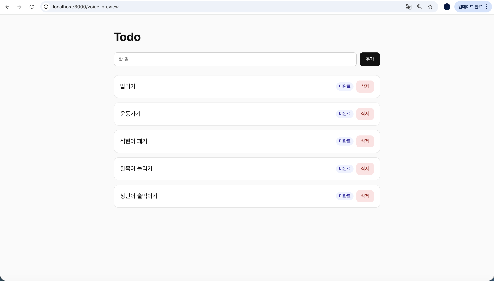
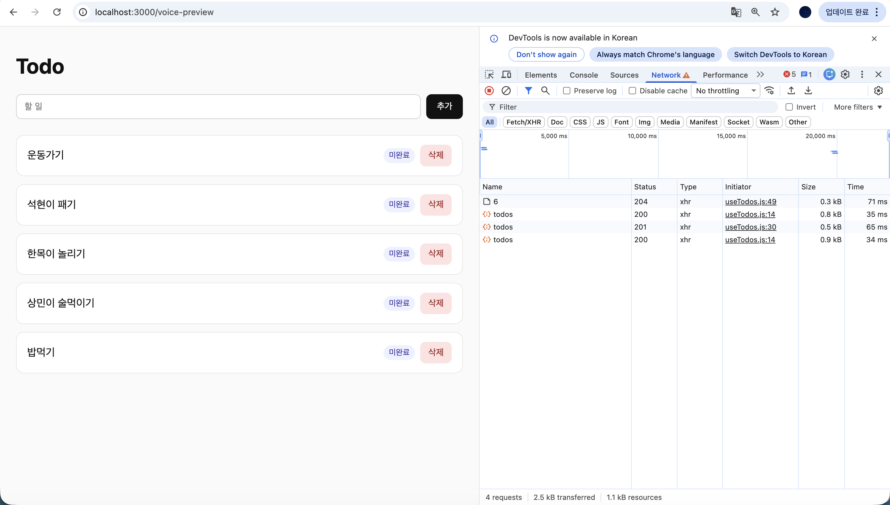
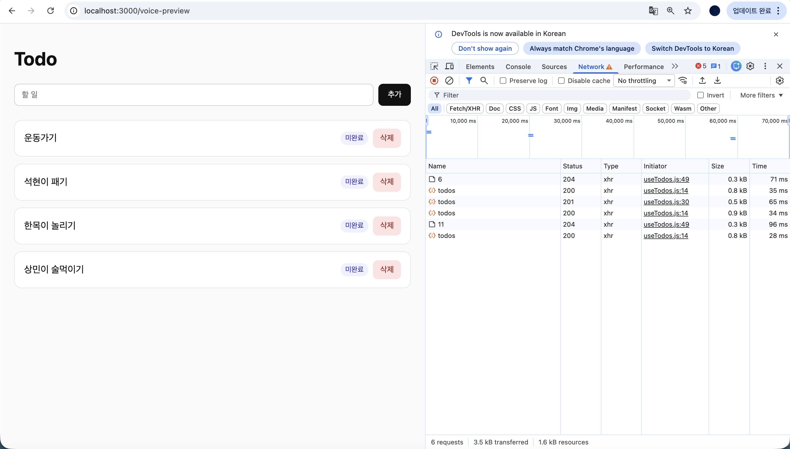

# Week 06 - Todo App

Spring Boot 백엔드와 React 프론트엔드를 이용한 Todo 애플리케이션입니다.

## 📋 기술 스택

### Backend
- **Spring Boot 4.0.6**
- **Java 21**
- **PostgreSQL 14.19**
- **Spring Data JPA**
- **Maven**

### Frontend
- **React 19.2.6**
- **Axios 1.16.1**
- **Create React App**

---

## 🚀 실행 방법

### 1. 데이터베이스 준비

PostgreSQL에서 `week06` 데이터베이스 생성:

```bash
psql -U postgres -c "CREATE DATABASE week06;"
```

또는 psql 쉘에서:
```sql
CREATE DATABASE week06;
```

### 2. 백엔드 실행

**터미널 1 (백엔드용)**

```bash
cd submissions/jyhyo02/backend

# Spring Boot 실행 (포트 8080)
./mvnw spring-boot:run
```

또는 Maven을 직접 사용:
```bash
mvn spring-boot:run
```

✅ **성공 메시지:**
```
Started Week06Application in X.XXX seconds (JVM running for X.XXX)
```

### 3. 프론트엔드 실행

**터미널 2 (프론트엔드용)**

```bash
cd submissions/jyhyo02/frontend

# 의존성 설치 (처음 실행 시에만)
npm install

# 개발 서버 실행 (포트 3000)
npm start
```

✅ **브라우저 자동 열림:** http://localhost:3000

---

## 📡 API 엔드포인트

### Base URL: `http://localhost:8080/api`

| 메서드 | 엔드포인트 | 설명 | Request Body |
|--------|----------|------|--------------|
| **GET** | `/todos` | 전체 todo 조회 | - |
| **GET** | `/todos/{id}` | 특정 todo 조회 | - |
| **POST** | `/todos` | todo 생성 | `{"title": "할 일", "description": "설명"}` |
| **PATCH** | `/todos/{id}/toggle` | 완료 상태 토글 | - |
| **DELETE** | `/todos/{id}` | todo 삭제 | - |
| **GET** | `/todos/search?completed=true&keyword=검색어` | todo 검색 | - |

---

## **각 과제 캡쳐**

- **2단계**

  

  

- **3단계**

  


## 🧪 Postman 테스트 방법

### 1. 전체 Todo 조회

**Request:**
```
GET http://localhost:8080/api/todos
```

**Response (200 OK):**
```json
[
  {
    "id": 1,
    "title": "회의 준비",
    "description": "오후 2시 회의 자료 정리",
    "completed": false,
    "createdAt": "2025-05-21T10:30:00"
  },
  {
    "id": 2,
    "title": "보고서 작성",
    "description": "",
    "completed": true,
    "createdAt": "2025-05-20T14:15:00"
  }
]
```

---

### 2. 새로운 Todo 생성

**Request:**
```
POST http://localhost:8080/api/todos
Content-Type: application/json

{
  "title": "회의 준비",
  "description": "오후 2시 회의 자료 정리"
}
```

**Response (201 Created):**
```json
{
  "id": 3,
  "title": "회의 준비",
  "description": "오후 2시 회의 자료 정리",
  "completed": false,
  "createdAt": "2025-05-21T10:45:00"
}
```

**유효성 검사:**
- 제목(title)은 필수, 공백일 수 없음
- 설명(description)은 선택사항
- 제목 최대 200글자, 설명 최대 1000글자

---

### 3. 특정 Todo 조회

**Request:**
```
GET http://localhost:8080/api/todos/1
```

**Response (200 OK):**
```json
{
  "id": 1,
  "title": "회의 준비",
  "description": "오후 2시 회의 자료 정리",
  "completed": false,
  "createdAt": "2025-05-21T10:30:00"
}
```

**에러 응답 (404 Not Found):**
```json
{
  "error": "Todo not found"
}
```

---

### 4. 완료 상태 토글

**Request:**
```
PATCH http://localhost:8080/api/todos/1/toggle
```

**Response (200 OK):**
```json
{
  "id": 1,
  "title": "회의 준비",
  "description": "오후 2시 회의 자료 정리",
  "completed": true,
  "createdAt": "2025-05-21T10:30:00"
}
```

> 다시 호출하면 `completed`가 `false`로 변경됨

---

### 5. Todo 삭제

**Request:**
```
DELETE http://localhost:8080/api/todos/1
```

**Response (200 OK):**
```json
{
  "message": "Todo deleted successfully"
}
```

또는 void (응답 본문 없음)

---

### 6. Todo 검색

#### 완료된 항목만 조회
```
GET http://localhost:8080/api/todos/search?completed=true
```

#### 미완료 항목만 조회
```
GET http://localhost:8080/api/todos/search?completed=false
```

#### 키워드로 검색
```
GET http://localhost:8080/api/todos/search?keyword=회의
```

#### 둘 다 조건 적용
```
GET http://localhost:8080/api/todos/search?completed=false&keyword=준비
```

**Response (200 OK):**
```json
[
  {
    "id": 1,
    "title": "회의 준비",
    "description": "오후 2시 회의 자료 정리",
    "completed": false,
    "createdAt": "2025-05-21T10:30:00"
  }
]
```

---

## 🔧 Postman 설정 팁

### 1. Environment 변수 설정 (선택사항)

Postman에서 `base_url` 변수를 설정하면 모든 요청에서 재사용 가능:

```
base_url = http://localhost:8080/api
```

그 후 모든 요청을 다음처럼 작성:
```
{{base_url}}/todos
{{base_url}}/todos/1
{{base_url}}/todos/1/toggle
```

### 2. 요청 본문 (Body) 작성

Postman에서 POST 요청 시:
1. **Body** 탭 선택
2. **raw** 선택
3. **JSON** 선택
4. 아래 본문 작성:

```json
{
  "title": "새로운 todo",
  "description": "설명"
}
```

### 3. Response 확인

요청 후 하단의 응답 창에서:
- **Status Code**: 200, 201, 404 등 확인
- **Body**: JSON 응답 확인
- **Headers**: Content-Type 확인

---

## 🌐 브라우저에서 테스트

프론트엔드 실행 후 http://localhost:3000 에서:

1. **할 일 추가**: 입력창에 내용 입력 후 "추가" 버튼 클릭
2. **완료 상태 토글**: 미완료/완료 버튼 클릭
3. **삭제**: 빨간 "삭제" 버튼 클릭
4. **실시간 동기화**: 모든 변경사항이 즉시 화면에 반영

---

## 📁 프로젝트 구조

```
submissions/jyhyo02/
├── backend/
│   ├── src/
│   │   ├── main/
│   │   │   ├── java/com/week06/
│   │   │   │   ├── domain/
│   │   │   │   │   ├── Todo.java (Entity)
│   │   │   │   │   ├── TodoRepository.java
│   │   │   │   │   ├── TodoService.java
│   │   │   │   │   └── TodoController.java
│   │   │   │   ├── config/
│   │   │   │   │   └── CorsConfig.java
│   │   │   │   └── Week06Application.java
│   │   │   └── resources/
│   │   │       └── application.properties
│   │   └── test/...
│   ├── build.gradle
│   └── pom.xml
│
└── frontend/
    ├── src/
    │   ├── api/
    │   │   └── axios.js (API 클라이언트)
    │   ├── hooks/
    │   │   └── useTodos.js (커스텀 훅)
    │   ├── App.js (메인 컴포넌트)
    │   ├── App.css
    │   └── index.js
    ├── package.json
    └── public/...
```

---

## ⚙️ 환경 설정

### backend/src/main/resources/application.properties

```properties
spring.datasource.url=jdbc:postgresql://localhost:5432/week06
spring.datasource.username=postgres
spring.datasource.password=
spring.jpa.hibernate.ddl-auto=update
spring.jpa.database-platform=org.hibernate.dialect.PostgreSQLDialect
spring.jpa.show-sql=true
```

### frontend/package.json (proxy 설정)

```json
{
  "name": "frontend",
  "proxy": "http://localhost:8080",
  ...
}
```

이를 통해 프론트에서 `/api/todos`로 요청하면 자동으로 `http://localhost:8080/api/todos`로 프록시됨

---

## ✨ 주요 기능

- ✅ Todo 생성 (CRUD - Create)
- ✅ Todo 조회 (CRUD - Read)
- ✅ 완료 상태 토글 (CRUD - Update)
- ✅ Todo 삭제 (CRUD - Delete)
- ✅ 키워드 검색 및 완료 상태 필터링
- ✅ 실시간 UI 동기화
- ✅ 에러 처리 및 로딩 상태 표시

---

## 📝 작성자

Week 06 Assignment - 2025년 5월
