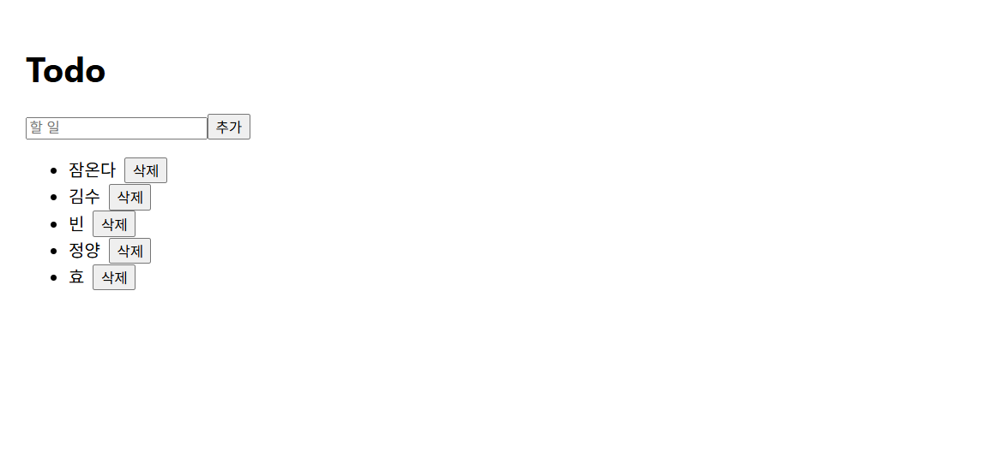
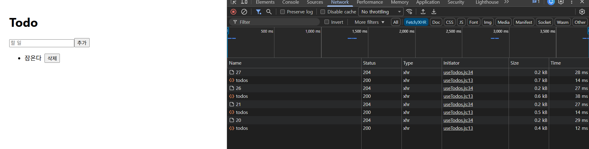

# 터미널 1 - backend
cd backend 
./mvnw spring-boot:run

# 터미널 2 - frontend
cd frontend
npm install axios
npm start 

백: http://localhost:8080
프론트: http://localhost:3000

# 제출 체크리스트
- [x] `submissions/kbx1498/backend/` — Spring Boot
- [x] `submissions/kbx1498/frontend/` — React
- [x] `README.md`에 백엔드·프론트 실행 명령, 포트(8080/3000) 기재
- [x] 목록 조회·추가 동작 (필수)
- [x] 삭제 또는 완료 토글 중 하나 이상 (필수) - 삭제 기능 구현
- [x] Network 탭 캡처 또는 screenshots 폴더
- [x] `node_modules/` 미포함
- [x] (선택) `useTodos` 훅 분리
- [ ] (선택) Axios 인터셉터

# 구현한 API 연동
- [x] GET `/api/todos`
- [x] POST `/api/todos`
- [x] DELETE `/api/todos/{id}`

## 실행 화면
1. 

2. 