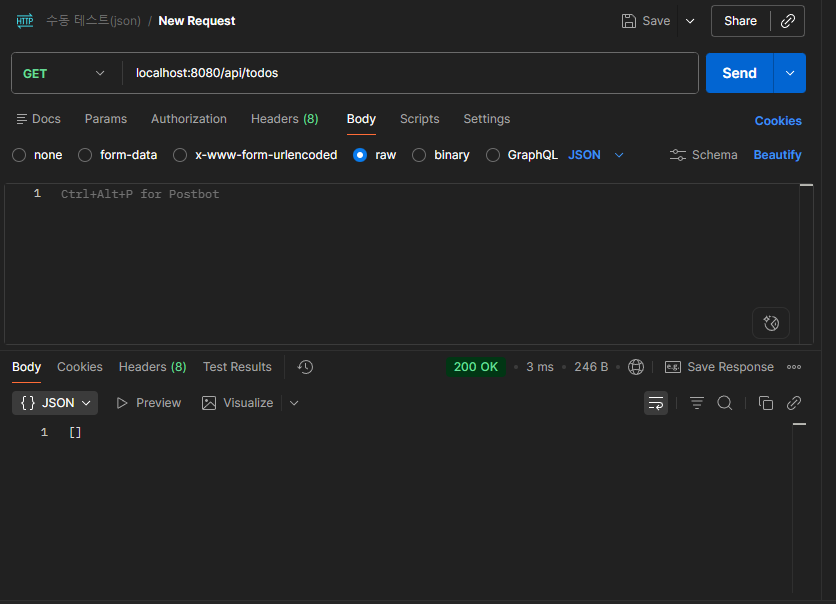
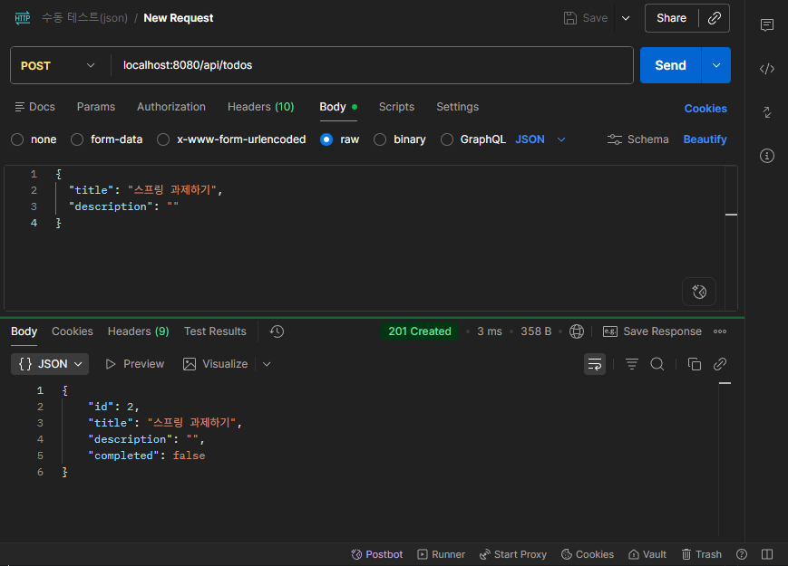
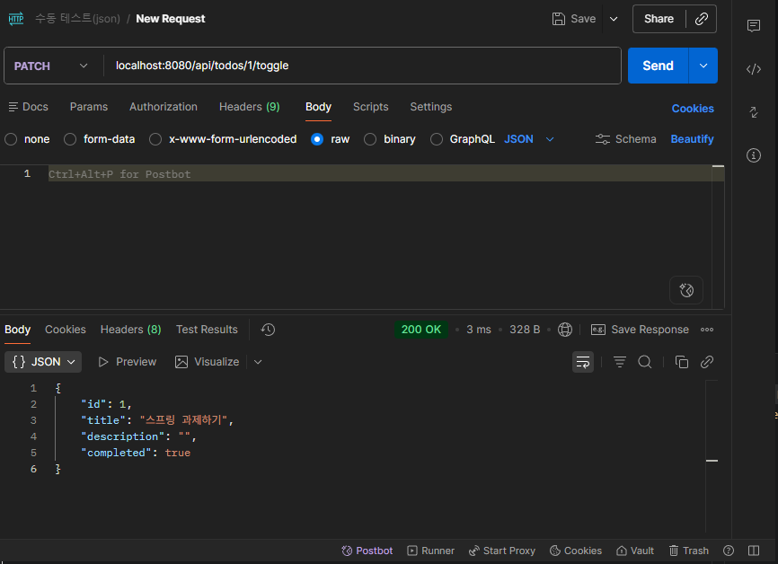
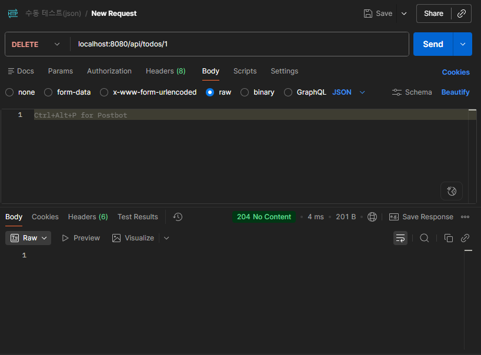
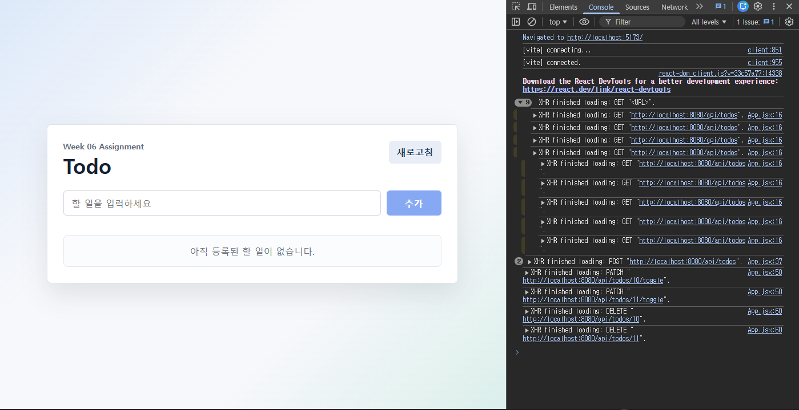

# 6주차 과제 - React와 Spring Boot Todo 연동

## 실행 방법

### 터미널 1 - backend

```bash
cd submissions/shm3041/backend
./gradlew bootRun
```

Windows PowerShell에서는 다음 명령도 사용할 수 있습니다.

```bash
.\gradlew.bat bootRun
```

### 터미널 2 - frontend

```bash
cd submissions/shm3041/frontend
npm install
npm run dev
```

- 백엔드: http://localhost:8080
- 프론트엔드: http://localhost:5173
- API baseURL: http://localhost:8080/api

## 구현 기능

- GET `/api/todos`: Todo 목록 조회
- POST `/api/todos`: Todo 추가
- PATCH `/api/todos/{id}/toggle`: 완료/미완료 토글
- DELETE `/api/todos/{id}`: Todo 삭제
- 로딩 문구와 에러 문구 표시
- CORS 허용: `http://localhost:3000`, `http://localhost:5173`

## Network 탭 확인 요청

- `GET http://localhost:8080/api/todos` - 200
- `POST http://localhost:8080/api/todos` - 201
- `PATCH http://localhost:8080/api/todos/{id}/toggle` - 200
- `DELETE http://localhost:8080/api/todos/{id}` - 204

## 막혔던 오류와 해결 방법

- Vite는 기본 포트가 `5173`이므로, 과제 예시의 `localhost:3000`만 CORS에 등록하면 브라우저에서 CORS 오류가 발생할 수 있습니다. `CorsConfig`의 `allowedOrigins`에 `http://localhost:5173`을 함께 추가해서 해결했습니다.







